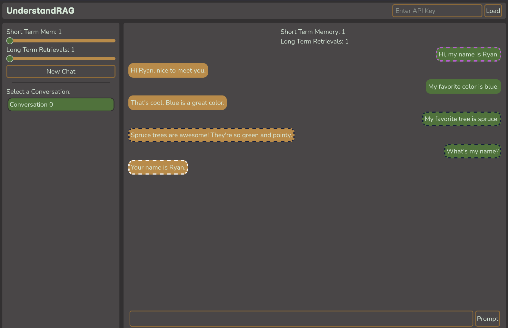

# Understanding Retrieval Augmented Generation

Retrieval Augmented Generation (RAG) is a method of supplementing LLM inputs through supplying information that was retrieved specifically tailored to help with the task at hand.

This project consists of a website that helps a user understand how an implementation of RAG can improve results from an LLM. It allows the user to select a short term memory length that the LLM can always see. The user can also choose a number of long term memory retrievals, where an embedding model chooses the most relevant messages from those not supplied in the short term memory.



The black outlines designate that these message were included in the short term memory. Any messages in a pink outline were retrieved with RAG. In the above example, RAG allowed the chat bot to remember a message it otherwise would not have taken into context.

## Instructions to run locally

1. Clone

```sh
git clone https://github.com/kyteware/understandrag
cd understandrag/understandrag
```

2. Run
```sh
# npm is required to be installed
npm install
npm run build
npm run start
```

3. Get API key. Go to the link in the tooltip on the api key text entry and grab an API key from Google.

4. Create a new chat with a configured short and long term memory.

5. Fire away!